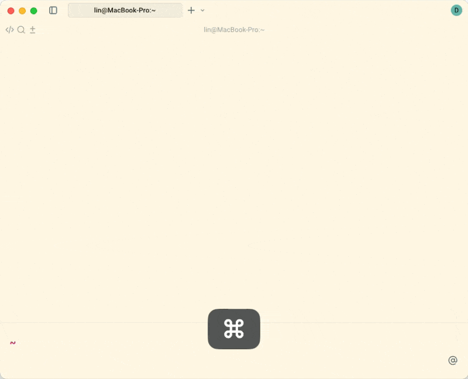
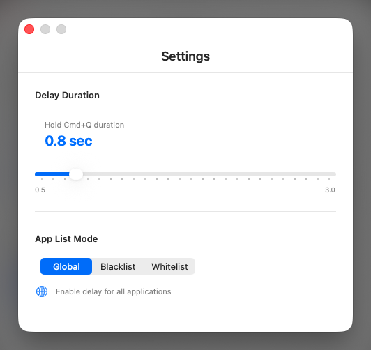

# SlowQuit

<div align="center">


**A macOS menu bar app that prevents accidental app quits by adding a delay to Cmd-Q**

[Features](#features) • [Installation](#installation) • [Usage](#usage) • [中文文档](README_CN.md)






</div>

---

## Overview

SlowQuit adds a customizable delay to the Cmd-Q keyboard shortcut on macOS, preventing accidental application quits. When you press Cmd-Q, a circular progress indicator appears and you must hold the keys for the configured duration before the app quits.

## Features

- **Global Cmd-Q Interception** - Works across all applications
- **Customizable Delay** - Adjust delay duration from 0.5 to 3.0 seconds
- **App List Management** - Whitelist/blacklist specific apps
- **Visual Progress Indicator** - Circular overlay shows remaining time
- **Lightweight & Native** - Built with Swift and SwiftUI
- **Privacy-Focused** - Works locally, no data collection
- **Multilingual** - English and Simplified Chinese support

## Installation

### Download Release

1. **Download** the latest `.dmg` file from [Releases](https://github.com/dudukee/SlowQuit/releases)
2. **Open the .dmg** file
3. **Drag SlowQuit** to your Applications folder
4. **Launch** from Applications folder

### First Launch Setup

When you first launch SlowQuit, macOS will show a security warning:

1. **Gatekeeper Warning**: "SlowQuit" cannot be opened because it is from an unidentified developer
   - Click **"Cancel"**
   - Open **System Settings → Privacy & Security**
   - Scroll to Security section and click **"Open Anyway"**
   - Click **"Open"** in the confirmation dialog

2. **Accessibility Permission**: Required for keyboard monitoring
   - Click **"Open System Settings"** when prompted
   - Enable SlowQuit in **Privacy & Security → Accessibility**
   - Restart SlowQuit

**Alternative Method**: Right-click on SlowQuit.app → Open → Open (in confirmation dialog)

## Usage

### Basic Usage

1. Press and **hold** Cmd-Q in any application
2. A circular progress indicator appears on screen
3. Keep holding until the progress completes (default: 1 second)
4. Release early to cancel the quit operation

### Menu Bar Options

- **Enable/Disable** - Toggle Cmd-Q interception
- **Settings** - Configure delay duration and app lists
- **Launch at Login** - Start automatically on boot
- **Check for Updates** - Manual update checking
- **About** - View version information
- **Quit** - Exit SlowQuit

### Settings Configuration

**Delay Duration**: Adjust the hold time from 0.5 to 3.0 seconds

**App List Modes**:
- **Global**: Apply to all applications (default)
- **Whitelist**: Only apply to selected apps
- **Blacklist**: Exclude selected apps from delay

**Managing App Lists**:
1. Select whitelist or blacklist mode
2. Click "Manage App List"
3. Add applications from running apps or browse installed apps
4. Remove apps with the × button

## Building from Source

### Requirements
- macOS 12.0+
- Xcode 14.0+
- Swift 5.9+

### Build Steps

1. **Clone and open**:
   ```bash
   git clone https://github.com/dudukee/slowquit.git
   cd slowquit
   open SlowQuit.xcodeproj
   ```

2. **Configure signing**:
   - Select project → Signing & Capabilities
   - Choose your signing team or "Sign to Run Locally"

3. **Build and run**:
   ```bash
   xcodebuild -project SlowQuit.xcodeproj -scheme SlowQuit -configuration Release build
   ```
   Or press Cmd+R in Xcode.

4. **Grant accessibility permission** when prompted and restart the app.

## Troubleshooting

### App Won't Open
- Open System Settings → Privacy & Security
- Click "Open Anyway" next to the SlowQuit message
- Alternatively: Right-click app → Open → Open

### Cmd-Q Not Working
- Check Accessibility permission in System Settings
- Ensure SlowQuit is enabled in Privacy & Security → Accessibility
- Restart the app

### Launch at Login Issues
- macOS 13+: System Settings → General → Login Items
- Remove and re-add SlowQuit to the login items list

## Privacy & Security

- **Local Operation**: All processing happens on your Mac
- **No Telemetry**: Zero analytics or usage tracking
- **Open Source**: Full source code available for audit
- **Minimal Permissions**: Only Accessibility permission for keyboard monitoring

**Why Accessibility Permission?**
Required to monitor global keyboard events using CGEventTap - the only way to intercept Cmd-Q before it reaches applications.

## License

MIT License - see [LICENSE](LICENSE) file for details.

## Support

- **Issues**: [GitHub Issues](https://github.com/dudukee/SlowQuit/issues)
- **Updates**: [Releases](https://github.com/dudukee/SlowQuit/releases)

---

**Made for macOS users who hate accidental quits**